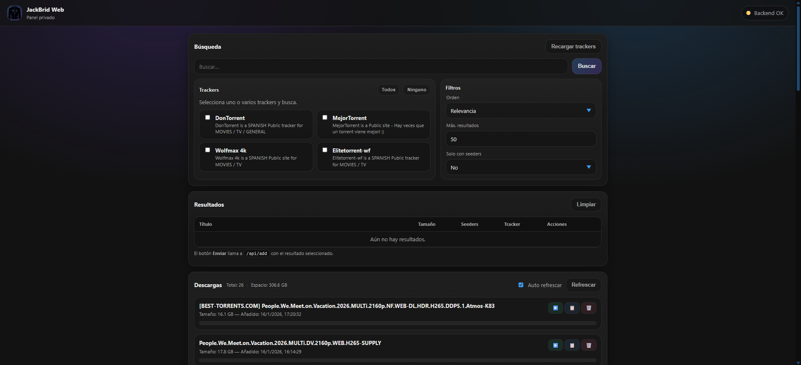
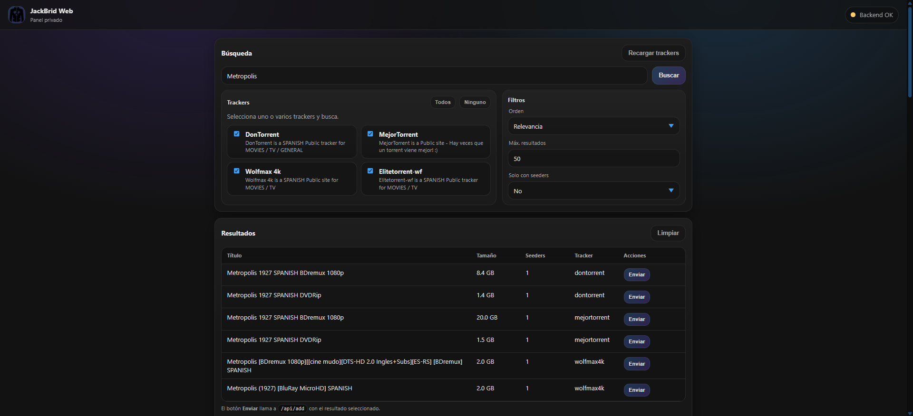
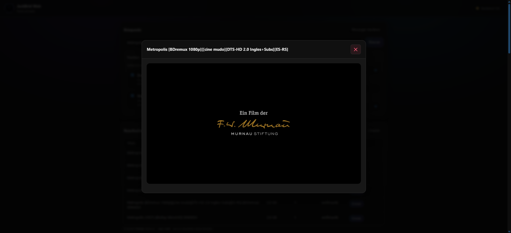

# 🎬 JackBrid

<div align="center">


**Panel privado de búsqueda y streaming de torrents**

**Documentación:** https://miketroll.me/JackBrid

Una aplicación web moderna que integra Jackett y AllDebrid para buscar, descargar y reproducir contenido torrent directamente en tu navegador.


*Vista principal de la aplicación*


*Busqueda de torrents*


*Reproductor de video integrado*

</div>

---

## 📋 Índice

- [Características](#-características)
- [Tecnologías](#️-tecnologías)
- [Requisitos Previos](#-requisitos-previos)
- [Instalación](#-instalación)
- [Uso](#-uso)
- [Estructura del Proyecto](#-estructura-del-proyecto)
- [API](#-api)
- [Contribuir](#-contribuir)
- [Licencia](#-licencia)

---

## ✨ Características

### 🔍 Búsqueda Avanzada
- **Multi-tracker**: Busca simultáneamente en múltiples trackers de Jackett
- **Filtros inteligentes**: Ordena por relevancia, seeders, tamaño o fecha
- **Resultados en tiempo real**: Visualización instantánea de resultados
- **Solo con seeders**: Filtra resultados activos

### 📥 Gestión de Descargas
- **Integración con AllDebrid**: Añade magnets y torrents directamente
- **Conversión automática**: Convierte torrents a enlaces directos
- **Descarga directa**: Descarga archivos sin esperas

### 🎥 Reproductor Integrado
- **Streaming directo**: Reproduce videos sin descargar
- **Interfaz Plyr**: Reproductor moderno y responsive
- **Múltiples formatos**: Soporte para MP4, MKV, AVI y más
- **⚠️ Limitación de audio**: El reproductor web solo soporta códecs de audio compatibles con HTML5 (AAC, MP3, Opus). Archivos con AC3, DTS, TrueHD u otros códecs avanzados pueden reproducirse sin sonido. Para estos casos, se recomienda copiar el enlace del archivo y reproducirlo con VLC u otro reproductor local

### 🎨 Interfaz de Usuario
- **Diseño moderno**: UI limpia y profesional
- **Responsive**: Adaptable a móviles, tablets y desktop
- **Estado en tiempo real**: Indicador de conexión con los servicios
- **Acceso rápido**: Links directos a Jackett y AllDebrid

### 🔧 Características Técnicas
- **Dockerizado**: Fácil despliegue con Docker Compose
- **API REST**: Backend modular y escalable
- **Salud del sistema**: Endpoint de health check
- **CORS habilitado**: Acceso desde cualquier origen

---

## 🛠️ Tecnologías

### Backend
- **Node.js** + **Express**: Servidor API REST
- **node-fetch**: Cliente HTTP para APIs externas
- **cors**: Manejo de Cross-Origin Resource Sharing
- **parse-torrent**: Parseo de archivos torrent
- **form-data**: Manejo de uploads multipart

### Frontend
- **HTML5** + **CSS3** + **JavaScript Vanilla**
- **Plyr**: Reproductor de video moderno
- **Responsive Design**: Mobile-first approach

### Infraestructura
- **Docker** + **Docker Compose**: Containerización
- **Nginx**: Servidor web y reverse proxy
- **Jackett**: Meta-tracker de torrents
- **AllDebrid**: Servicio de descarga premium

---

## 📦 Requisitos Previos

Antes de comenzar, asegúrate de tener instalado:

- [Docker](https://www.docker.com/get-started) (v20.10 o superior)
- [Docker Compose](https://docs.docker.com/compose/install/) (v2.0 o superior)
- Cuenta en [AllDebrid](https://alldebrid.com/) (con API Key)

---

## 🚀 Instalación

Sigue estos pasos para configurar el proyecto:

### 1. Clonar el repositorio

```bash
git clone https://github.com/MikeTrollYT/JackBrid.git
cd JackBrid
```

### 2. Levantar los servicios

```bash
docker compose up -d
```

Esto iniciará:
- **Jackett** en `http://localhost:9117`
- **Nginx + Frontend** en `http://localhost:8998`
- **Backend API** en puerto interno 3000

### 3. Configurar Jackett

1. Abre en tu navegador: **http://localhost:9117/**
2. Copia la **API Key** que aparece en la interfaz de Jackett
3. Configura tus trackers favoritos en Jackett

### 4. Configurar variables de entorno

Crea un archivo `.env` en la raíz del proyecto:

```bash
touch .env
```

Edita el archivo `.env` y añade tus credenciales:

```env
JACKETT_URL=http://jackett:9117
JACKETT_API_KEY=tu_api_key_de_jackett_aqui
ALLDEBRID_API_KEY=tu_api_key_de_alldebrid_aqui
```

### 5. Reconstruir el backend

```bash
docker compose up -d --build backend
```

### 6. ¡Listo! 🎉

Abre tu navegador en **http://localhost:8998** y disfruta de JackBrid Web.

---

## 💡 Uso

### Búsqueda de Torrents

1. **Selecciona trackers**: Marca uno o varios trackers de la lista
2. **Escribe tu búsqueda**: Introduce el nombre del contenido que buscas
3. **Configura filtros**: Ajusta el orden, límite de resultados y filtro de seeders
4. **Busca**: Haz clic en "Buscar" o presiona Enter
5. **Explora resultados**: Revisa la lista de torrents encontrados

### Añadir a AllDebrid

1. En los resultados, haz clic en **"Añadir a AllDebrid"**
2. El sistema convertirá el torrent/magnet automáticamente
3. Aparecerá en tu lista de elementos de AllDebrid

### Reproducir Contenido

1. Una vez añadido a AllDebrid, haz clic en **"Reproducir"**
2. El reproductor se abrirá con el contenido
3. Disfruta del streaming directo

### Copiar Contenido

1. Haz clic en **"Copiar"** desde la lista de AllDebrid
2. El archivo se copiará directamente a tu portapapeles

---

## 📁 Estructura del Proyecto

```
JackBrid/
├── backend/
│   ├── app.js                 # Servidor Express principal
│   ├── jackettClient.js       # Cliente para API de Jackett
│   ├── alldebridClient.js     # Cliente para API de AllDebrid
│   ├── package.json           # Dependencias del backend
│   ├── Dockerfile             # Imagen Docker del backend
│   └── downloads/             # Carpeta de descargas temporales
├── frontend/
│   ├── index.html             # Interfaz principal
│   ├── app.js                 # Lógica del frontend
│   ├── styles.css             # Estilos de la aplicación
│   └── img/                   # Recursos gráficos
├── nginx/
│   └── nginx.conf             # Configuración de Nginx
├── docker-compose.yml         # Orquestación de servicios
├── package.json               # Configuración del proyecto
├── .env                       # Variables de entorno (crear)
└── README.md                  # Este archivo
```

---

## 🔌 API

El backend expone los siguientes endpoints:

### `GET /health`
Verifica el estado de conexión con Jackett y AllDebrid.

**Respuesta:**
```json
{
  "ok": true
}
```

### `GET /links`
Obtiene las URLs de los paneles externos.

**Respuesta:**
```json
{
  "jackett": "http://localhost:9117",
  "alldebrid": "https://alldebrid.com/magnets/",
  "alldebridApiKey": "tu_api_key"
}
```

### `GET /trackers`
Lista todos los trackers configurados en Jackett.

**Respuesta:**
```json
{
  "trackers": [
    {
      "id": "1337x",
      "name": "1337x",
      "type": "public"
    }
  ]
}
```

### `GET /search`
Busca torrents en los trackers seleccionados.

**Parámetros:**
- `q` (string): Término de búsqueda
- `trackers` (string): IDs de trackers separados por comas
- `sort` (string): `relevance`, `seeders`, `size`, `date`
- `limit` (number): Máximo de resultados
- `onlySeeded` (string): `yes` o `no`

**Respuesta:**
```json
{
  "results": [
    {
      "title": "Example Torrent",
      "seeders": 100,
      "leechers": 20,
      "size": "1.5 GB",
      "magnet": "magnet:?xt=urn:btih:..."
    }
  ]
}
```

### `POST /add`
Añade un magnet/torrent a AllDebrid.

### `GET /items`
Lista los elementos en AllDebrid.

### `DELETE /item/:id`
Elimina un elemento de AllDebrid.

### `POST /download/:id`
Descarga un archivo de AllDebrid al servidor.

---

## 🤝 Contribuir

Las contribuciones son bienvenidas. Si quieres mejorar el proyecto:

1. Fork el repositorio
2. Crea una rama para tu feature (`git checkout -b feature/nueva-funcionalidad`)
3. Commit tus cambios (`git commit -am 'Añade nueva funcionalidad'`)
4. Push a la rama (`git push origin feature/nueva-funcionalidad`)
5. Abre un Pull Request

---

## 📝 Licencia

Este proyecto es de código abierto y está disponible bajo la licencia MIT.

---

## ⚠️ Disclaimer

Este proyecto es solo para fines educativos. Asegúrate de cumplir con las leyes de derechos de autor de tu país. Los desarrolladores no se hacen responsables del uso indebido de esta herramienta.

---

## 📧 Contacto

Si tienes preguntas o sugerencias, no dudes en abrir un issue en GitHub.

---

<div align="center">

**Hecho con ❤️ por la comunidad**

⭐ Si te gusta el proyecto, ¡dale una estrella en GitHub!

</div>

